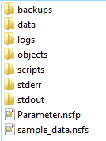
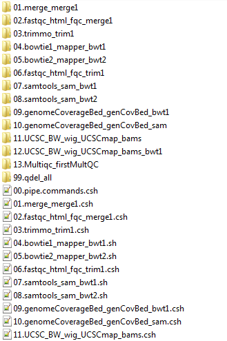
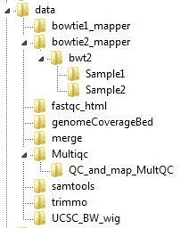
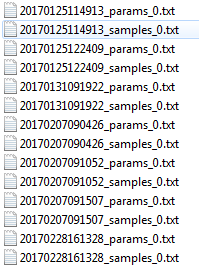
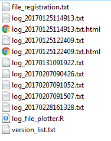
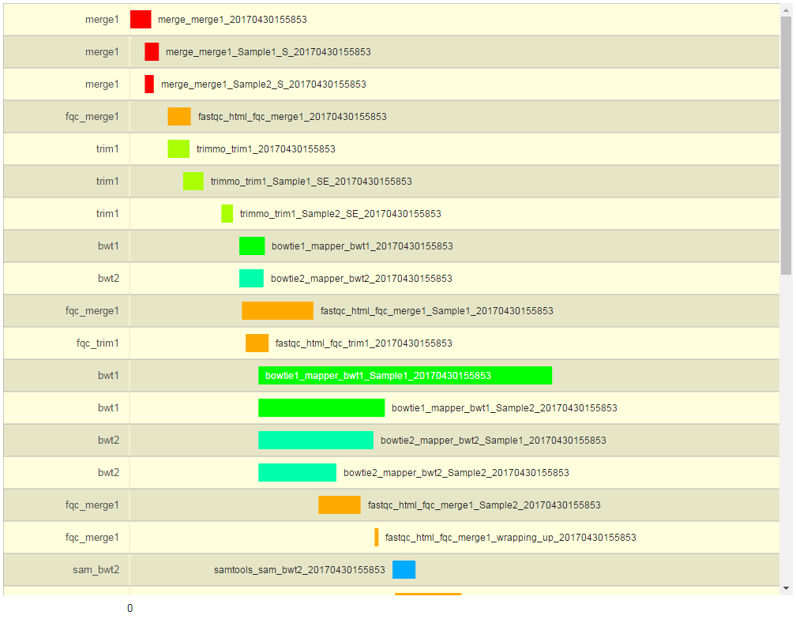
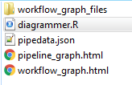
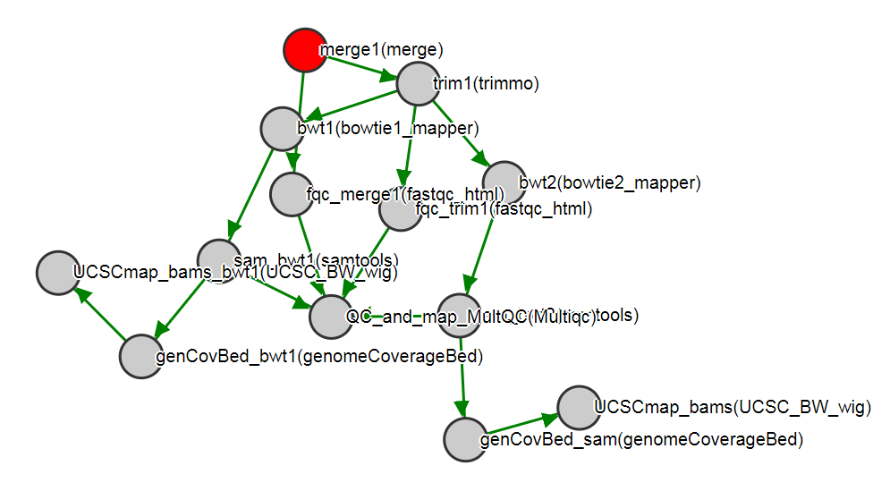
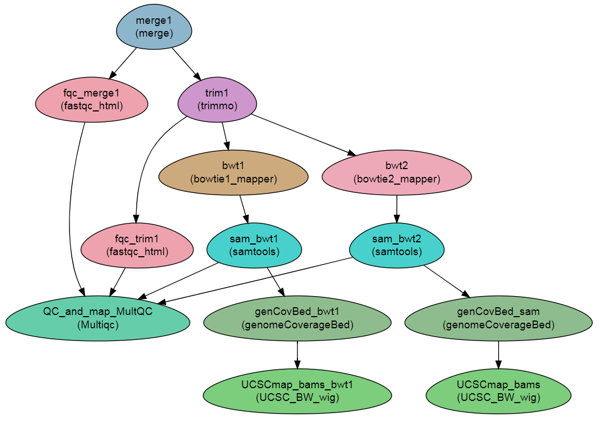

==========================
Output directory structure
==========================

.. include:: links.rst

**Author:** Menachem Sklarz

**Affiliation:** |affiliation|

.. contents:: Table of Contents
   :depth: 2
   :local:
   :backlinks: top

The main directory structure 
-----------------------------

The directories are elaborated on below.
 

   The directory structure created by **NeatSeq-Flow**
   
The scripts directory
-----------------------------

* Executing ``csh 00.workflow.commands.csh`` will execute the entire workflow.
* The scripts beginning ``01.merge…`` etc. execute entire steps.
* The actual scripts running each step per sample or on the entire project are contained in the equivalent directories ``01.merge…`` etc.
* The scripts are numbered by execution order (see ``00.workflow.commands.csh``)

   The scripts directory created by **NeatSeq-Flow**

  
The data directory
-----------------------------

In the data directory, the analysis outputs are organized by module, by module instance and by sample. 

Below is the data directory for the example, showing the tree organization for the bowtie2_mapper and Multiqc modules. 

   The data directory created by **NeatSeq-Flow**, showing the tree organization.

  
The backup directory 
---------------------

The backup directory contains a history of workflow sample and parameter files.
 

   The backups directory created by **NeatSeq-Flow**

 
The logs directory
-------------------

The logs directory contains various logging files:

1. **version_list**. A list of all the versions of the workflow with equivalent comments 
2. **file_registration**. A list of files produced, including md5 signatures, and the script and workflow version that produced them
3. ``log_file_plotter.R``. An R script for producing a plot of the execution times. (Run with Rscript and receives a single argument – a log file to plot)
4. ``log_<workflow_ID>.txt``. Log of the execution times of the script per workflow version ID.
5. ``log_<workflow_ID>.txt.html``. Graphical representation of the progress of the WF execution, as produced by the ``log_file_plotter.R`` script (see figure below)
 
 

   The logs directory created by **NeatSeq-Flow**

   A graphical representation of the workflow execution.

The stderr and stdout directories
-----------------------------------

* The stderr and stdout directories store the script standard error and outputs, respectively. 
* These are stored in files containing the module name, module instance, sample name, workflow ID and cluster job ID.
 
The objects directory
-----------------------------

The objects directory contains various files describing the workflow: 

   The objects directory created by **NeatSeq-Flow**

   
1. ``pipeline_graph.html``: An SVG diagram of the workflow.

2. ``diagrammer.R``: an R script for producing a DiagrammeR diagram of the workflow. 
3. ``pipedata.json``: A JSON file containing all the workflow data, for uploading to JSON compliant databases etc. 
4. ``workflow_graph.html`` is the output from executing ``Rscript diagrammer.R``.

.. note:: The ``diagrammer.R`` script requires installing the ``DiagrammeR`` and ``htmlwidgets`` R packages.

