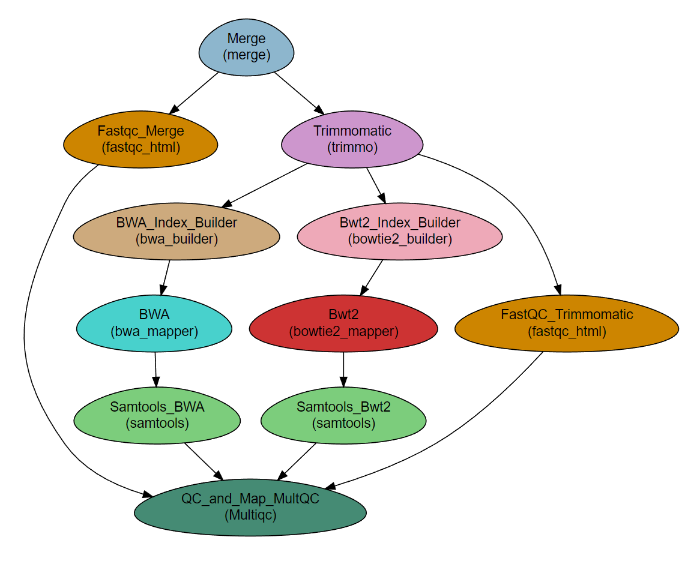

.. _tutorial:

========================================
**NeatSeq-Flow** Tutorial
========================================

.. include:: links.rst

**Author:** Liron Levin

**Affiliation:** |affiliation|

.. contents:: Table of Contents
   :depth: 2
   :local:
   :backlinks: top

This tutorial describes how to create the workflow described in the **NeatSeq-Flow** manuscript.

.. In order to execute the scripts, you will need access to a computer cluster running an SGE job scheduler.

--------------------
Short Description
--------------------

This example Workflow performs:

* Quality testing and trimming of raw reads (paired or single).
* Alignment (“mapping”) of the reads to each sample’s reference genome using two different programs.
* Produce sorted bam file for each sample as final results.
* Creates a report on reads and mapping quality.

This Workflow is a classical starting point for a bacterial sequencing analysis Workflow, of which additional steps can be implemented such as de-novo assembly, variant calling etc.

**The example Workflow is distributed as part of NeatSeq-Flow for quick testing.**

The Workflow consists of the following steps. The modules performing the steps are indicated in brackets.

.. csv-table:: 
    :header: "Step", "Module"
    :widths: 15, 10

    "Merge",                  "Merge"
    "Fastqc_Merge",           "fastqc_html"
    "Trimmomatic",            "trimmo"
    "FastQC_Trimmomatic",     "fastqc_html"
    "BWA_Index_Builder",      "bwa_builder"
    "BWA",                    "bwa_mapper"
    "Bwt2_Index_Builder",     "bowtie2_builder"
    "Bwt2",                   "bowtie2_mapper"
    "Samtools_BWA",           "samtools"
    "Samtools_Bwt2",          "samtools"
    "QC_and_Map_MultQC",      "Multiqc"

DAG
-----

Required data
--------------

This WF requires samples with ``fastq`` file(s) (paired or single) and for each sample it's reference genome in ``fasta`` format.

.. Note:: The files for the tutorial are included in the installation procedure below.

Required programs
------------------

* fastqc
* trimmomatic
* multiqc
* samtools=1.3
* BWA
* bowtie2

.. Note:: When installing with `conda`, the programs are installed as part of the installation process.

Sample File for Example 
-------------------------

::

    Title       Example_WF_From_the_manuscript

    #SampleID	Type			Path
    Sample1	Forward		Sample1F.fastq.gz
    Sample1	Reverse		Sample1R.fastq.gz
    Sample1	Nucleotide		Reference.fasta.gz
    Sample2	Forward		Sample2F.fastq.gz
    Sample2	Reverse		Sample2R.fastq.gz
    Sample2	Nucleotide		Reference.fasta.gz
    Sample3	Forward		Sample3F.fastq.gz
    Sample3	Reverse		Sample3R.fastq.gz
    Sample3	Nucleotide		Reference.fasta.gz

----------------------
Running the Workflow
----------------------

Using `conda` virtual environments
-----------------------------------

The easiest way to run the WF is through `conda` virtual environment.

For that you will need:

* Conda installed on your system (see `miniconda  <https://conda.io/miniconda.html>`_) and **in your path**.
* The NeatSeq-Flow |conda_tut_install|.

To install, perform the following steps:

1. Create NeatSeq-Flow project directory

.. code-block:: csh

    mkdir Example_WF
    cd Example_WF

2. Getting the installation file 

You will need to copy the |conda_tut_install| file into the current directory, or download it directly with the following command:

.. code-block:: csh

    curl http://neatseq-flow.readthedocs.io/en/latest/_downloads/NeatSeq_Flow_Tutorial_Install.yaml > NeatSeq_Flow_Tutorial_Install.yaml
    
3. Install the NeatSeq-Flow environment

The following commands will install NeatSeq-Flow and all the required modules and programs. 

.. code-block:: csh

    conda-env create -f  NeatSeq_Flow_Tutorial_Install.yaml

.. Attention:: From the following step onwards, you should be in ``bash`` shell

    .. code-block:: csh

        bash

3. Activate the NeatSeq-Flow environment

.. code-block:: csh

    source activate NeatSeq_Flow_Tutorial

Run NeatSeq-Flow
~~~~~~~~~~~~~~~~~

1. Edit the example Workflow parameter file to suit your cluster

The file will be located at this path::

    $CONDA_PREFIX/TUTORIAL/Example_WF_conda_env.yaml
    
Edit the global params section, particularly the following two lines::

    Global_params:
        Qsub_path:      /PATH_TO_YOUR_QSUB/
        Qsub_q:         NAME_OF_YOUR_QUEUE.q

The ``Qsub_path`` parameter can be determined by executing the following command and replacing ``/PATH_TO_YOUR_QSUB/`` with the result.

.. code-block:: csh

    dirname `which qsub`

You can do the editting with any text editor of your liking.

.. warning::  Don't forget to save the file when you done!

2. Execute **NeatSeq-Flow** to create the workflow scripts:

.. code-block:: csh

    neatseq_flow.py                                                             \
        --sample_file $CONDA_PREFIX/TUTORIAL/Sample_sets/Samples_conda.nsfs     \
        --param_file  $CONDA_PREFIX/TUTORIAL/Example_WF_conda_env.yaml          \
        --message     "an informative message"

.. note::  If NeatSeq-Flow says :``Finished successfully....`` it is OK to move on.

Execute the Example Workflow
~~~~~~~~~~~~~~~~~~~~~~~~~~~~~~

In the command line type:

.. code-block:: csh

    csh scripts/00.pipe.commands.csh

Running the **NeatSeq-Flow** monitor
~~~~~~~~~~~~~~~~~~~~~~~~~~~~~~~~~~~~~

When the workflow is running, you can check it's progress by running the built-in monitor: 

.. code-block:: csh

    neatseq_flow_monitor.py

.. Note:: If you executed **NeatSeq-Flow** several times before running the workflow, you will have to select the correct log file in the upper window of the monitor.

    The log file is identified by the run code, which is composed of the date and time of **NeatSeq-Flow** execution.
    
Checking the workflow output
~~~~~~~~~~~~~~~~~~~~~~~~~~~~~~

Browse the ``data/`` directory for the outputs from the programs executed by the workflow.

Deactivate the **NeatSeq-Flow** environment
~~~~~~~~~~~~~~~~~~~~~~~~~~~~~~~~~~~~~~~~~~~~

To leave the **NeatSeq-Flow** virtual *conda* environment, execute the following command:

.. code-block:: csh

    source deactivate

Removing the **NeatSeq-Flow** environment
~~~~~~~~~~~~~~~~~~~~~~~~~~~~~~~~~~~~~~~~~~

When done, you can remove the *conda* environment you created with the following command:

.. code-block:: csh

    conda remove --name  NeatSeq_Flow_Tutorial --all

Using a local copy of **NeatSeq-Flow**
---------------------------------------

If you have all the required programs installed on your system you can download and run **NeatSeq-Flow** without installation.

You will need:

* Python 2.7 installed
* The python dependencies: yaml and bunch (you can install them by using ``pip install yaml bunch`` in the command line).

Download the **NeatSeq-Flow** repositories from github
~~~~~~~~~~~~~~~~~~~~~~~~~~~~~~~~~~~~~~~~~~~~~~~~~~~~~~~~~

First, create a directory for the tutorial:

.. code-block:: csh

    mkdir neatseq-flow-tutorial
    cd neatseq-flow-tutorial
   
The following commands will download the repositories you will need for this tutorial:

1. The main **NeatSeq-Flow** repository.
2. The tutorial datasets and workflow repository.

.. code-block:: csh

  git clone https://github.com/bioinfo-core-BGU/neatseq-flow.git
  git clone https://github.com/bioinfo-core-BGU/neatseq-flow-tutorial.git

Finally, create a directory for the **NeatSeq-Flow** project, and copy the tutorial parameter and sample files into it:

.. _copying_files:

.. code-block:: csh

    mkdir Example_WF
    cd Example_WF
    cp ../neatseq-flow-tutorial/Example_WF.yaml ../neatseq-flow-tutorial/Samples.nsfs ./

Preparing the workflow parameter file
~~~~~~~~~~~~~~~~~~~~~~~~~~~~~~~~~~~~~~~~~

Edit the example Workflow parameter file to suit your cluster.

.. code-block:: csh

    nano  Example_WF.yaml

.. note::  **Don't forget to save the file when you done!**

1. Edit the global params section, particularly the following two lines::

    Global_params:
        Qsub_path:      /PATH_TO_YOUR_QSUB/
        Qsub_q:         NAME_OF_YOUR_QUEUE.q

The ``Qsub_path`` parameter can be determined by executing the following command and replacing ``/PATH_TO_YOUR_QSUB/`` with the result.

.. code-block:: csh

    dirname `which qsub`
    
1. Edit the definitions in the variables section (add the **FULL PATHs** for all required programs)::

    Vars:
        Programs:
            FastQC:             /FULL_PATH_TO/fastqc_Executable
            Trimmomatic:        /FULL_PATH_TO/trimmomatic_Executable
            BWA:                /FULL_PATH_TO/bwa_Executable
            bowtie2:            /FULL_PATH_TO/bowtie2_Executable
            bowtie2_builder:    /FULL_PATH_TO/bowtie2-build_Executable
            samtools:           /FULL_PATH_TO/samtools_Executable
            multiqc:            /FULL_PATH_TO/multiqc_Executable

Run NeatSeq-Flow
~~~~~~~~~~~~~~~~~

In the command line type:

.. code-block:: csh

    python ../neatseq-flow/bin/neatseq_flow.py  \
        --sample_file   Samples.nsfs            \
        --param_file    Example_WF.yaml         \
        --message     "an informative message"

.. note::  If **NeatSeq-Flow** says : ``Finished successfully....`` it is OK to move on.

Execute the Example Workflow
~~~~~~~~~~~~~~~~~~~~~~~~~~~~~~~~~~

In the command line type:

.. code-block:: csh

    csh scripts/00.pipe.commands.csh

Running the **NeatSeq-Flow** monitor
~~~~~~~~~~~~~~~~~~~~~~~~~~~~~~~~~~~~~

When the workflow is running, you can check it's progress by running the built-in monitor: 

.. code-block:: csh

    neatseq_flow_monitor.py

You can also check out the log files in the ``logs`` directory and the standard output and error files in ``stdout/`` and ``stderr/`` directories, respectively.

Checking the workflow output
~~~~~~~~~~~~~~~~~~~~~~~~~~~~~~

Browse the ``data/`` directory for the outputs from the programs executed by the workflow.

Using remote data files
---------------------------------------

Follow the steps above, but use the following parameter and sample files instead of those specified when :ref:`copying files <copying_files>` above.

.. code-block:: csh

    cp ../neatseq-flow-tutorial/Example_WF_from_ftp.yaml ../neatseq-flow-tutorial/Samples_from_FTP.nsfs ./

Edit the files as mentioned above and execute with:

.. code-block:: csh

    python ../neatseq-flow/bin/neatseq_flow.py     \
        --sample_file   Samples_from_FTP.nsfs      \
        --param_file    Example_WF_from_ftp.yaml   \
        --message     "an informative message"
