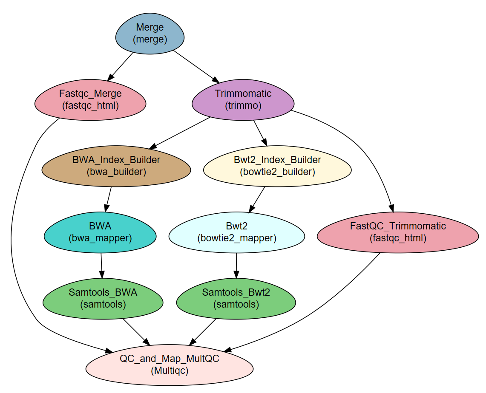

.. _tutorial:

========================================
**NeatSeq-Flow** Tutorial
========================================

.. include:: links.rst

**Author:** Liron Levin

**Affiliation:** |affiliation|

.. contents:: Table of Contents
   :depth: 2
   :local:
   :backlinks: top

This tutorial describes how to create the workflow described in the **NeatSeq-Flow** manuscript.

.. In order to execute the scripts, you will need access to a computer cluster running an SGE job scheduler.

--------------------
Short Description
--------------------

The example workflow performs:

* Quality testing and trimming of raw reads (paired or single).
* Alignment (“mapping”) of the reads to a reference genome using two different programs.
* Sorting the samples' bam files as final results.
* Creation of a report on reads and mapping quality.

The workflow is a classical starting point for a bacterial sequencing analysis workflow, of which additional steps can be implemented such as de-novo assembly, variant calling etc.

**The example workflow is distributed as part of NeatSeq-Flow for quick testing.**

The workflow consists of the following steps: 

.. csv-table:: 
    :header: "Step", "Module", "Program"
    :widths: 15, 10, 10

    "Merge","merge","-"
    "Fastqc_Merge","fastqc_html","fastqc"
    "Trimmomatic","trimmo","trimmomatic"
    "FastQC_Trimmomatic","fastqc_html","fastqc"
    "BWA_Index_Builder","bwa_builder","bwa"
    "BWA","bwa_mapper","bwa"
    "Bwt2_Index_Builder","bowtie2_builder","bowtie2"
    "Bwt2","bowtie2_mapper","bowtie2"
    "Samtools_BWA","samtools","samtools"
    "Samtools_Bwt2","samtools","samtools"
    "QC_and_Map_MultQC","Multiqc","MultiQC"

DAG
-----

Required data
--------------

This WF requires samples with ``fastq`` file(s) (paired or single) and a reference genome in ``fasta`` format.

.. Note:: The files for the tutorial are included in the installation procedure below.

Required programs
------------------

* fastqc
* trimmomatic
* multiqc
* samtools=1.3
* BWA
* bowtie2

.. Note:: When installing with `conda`, the programs are installed as part of the installation process.

Sample File for Example 
-------------------------

::

    Title	Example_WF_From_the_manuscript

    #Type	Path
    Nucleotide	Reference_genome.fasta

    #SampleID	Type	Path
    Sample1	Forward	Sample1F.fastq.gz
    Sample1	Reverse	Sample1R.fastq.gz
    Sample2	Forward	Sample2F.fastq.gz
    Sample2	Reverse	Sample2R.fastq.gz
    Sample3	Forward	Sample3F.fastq.gz
    Sample3	Reverse	Sample3R.fastq.gz

----------------------
Running the Workflow
----------------------

Using `conda` virtual environments
-----------------------------------

The easiest way to run the WF is through `conda` virtual environment.

For that you will need:

* Conda installed on your system (see `miniconda  <https://conda.io/miniconda.html>`_) and **in your path**.
* The :download:`NeatSeq-Flow CONDA installer <_static/NeatSeq_Flow_Tutorial_Install.yaml>`.

.. Attention:: This tutorial assumes `conda` is installed and on the search path. If it is not, append the `conda` path to all `conda`, `activate` and `deactivate` commands below.

To install, perform the following steps:

#. Create a **NeatSeq-Flow** project directory

    .. code-block:: bash

        mkdir Example_WF
        cd Example_WF

#. Get the installation file 

    You will need to copy the :download:`NeatSeq-Flow CONDA installer <_static/NeatSeq_Flow_Tutorial_Install.yaml>` file into the current directory, or download it directly with the following command:

    .. tabs::

       .. tab:: wget

            .. code-block:: bash

                wget http://neatseq-flow.readthedocs.io/en/latest/extra/NeatSeq_Flow_Tutorial_Install.yaml

       .. tab:: curl

            .. code-block:: bash

                curl http://neatseq-flow.readthedocs.io/en/latest/extra/NeatSeq_Flow_Tutorial_Install.yaml > NeatSeq_Flow_Tutorial_Install.yaml

    
#. Install the **NeatSeq-Flow** environment

    The following commands will install **NeatSeq-Flow** and all the required modules and programs.

    .. code-block:: bash

        conda env create -f  NeatSeq_Flow_Tutorial_Install.yaml

    .. Note:: For some versions of conda, you might have to replace ``conda env`` with ``conda-env``. If the command above does not work, try the following command:

        .. code-block:: bash

            conda-env create -f  NeatSeq_Flow_Tutorial_Install.yaml

    .. Attention:: From the following step onwards, you should be in ``bash`` shell

        .. code-block:: bash

            bash

#. Activate the **NeatSeq-Flow** environment

    .. code-block:: bash

        source activate NeatSeq_Flow_Tutorial

Run **NeatSeq-Flow**
~~~~~~~~~~~~~~~~~~~~~

#. Edit the example Workflow parameter file to suit your cluster

    The file will be located at this path::

        $CONDA_PREFIX/TUTORIAL/Example_WF_conda_env.yaml
        
    .. Attention:: After activating the virtual environment, ``$CONDA_PREFIX`` contains the path to the environment. Therefore, we use it below to reference the tutorial files.

    Edit the global params section, particularly the following two lines::

        Global_params:
            Qsub_path:      /PATH_TO_YOUR_QSUB/
            Qsub_q:         NAME_OF_YOUR_QUEUE.q

    The ``Qsub_path`` parameter can be determined by executing the following command and replacing ``/PATH_TO_YOUR_QSUB/`` with the result.

    .. code-block:: bash

        dirname `which qsub`

    You can do the editting with any text editor of your liking.

    .. .. warning::  Don't forget to save the file when you done!

#. Execute the following command to tell **NeatSeq-Flow** where the base conda installation is located:

    .. code-block:: bash

        export CONDA_BASE=$(conda info --root)

#. Execute **NeatSeq-Flow** to create the workflow scripts:

    .. note:: The three samples used in this example workflow are **SRR453031**, **SRR453032** and **SRR453033** from *Staphylococcus aureus* subsp. aureus Genome Sequencing project (BioProject **PRJNA157545**). The *Staphylococcus aureus* **GCF_000284535.1** genome assembly was used as reference genome.

    To save run-time and space, the raw sample files contain only the first 500,000 lines each.

    In the command line type:

    .. code-block:: bash

        neatseq_flow.py                                                             \
            --sample_file $CONDA_PREFIX/TUTORIAL/Sample_sets/Samples_conda.nsfs     \
            --param_file  $CONDA_PREFIX/TUTORIAL/Example_WF_conda_env.yaml          \
            --message     "NeatSeq-Flow example WF"

    .. tip:: To use the full raw samples files directly through FTP link in the command line type:

        .. code-block:: bash

            neatseq_flow.py                                                             \
                --sample_file $CONDA_PREFIX/TUTORIAL/Sample_sets/Samples_from_FTP.nsfs     \
                --param_file  $CONDA_PREFIX/TUTORIAL/Example_WF_conda_from_ftp.yaml          \
                --message     "NeatSeq-Flow example WF using ftp"

    .. note::  If **NeatSeq-Flow** says :``Finished successfully....`` it is OK to move on.

Execute the Example Workflow
~~~~~~~~~~~~~~~~~~~~~~~~~~~~~~

In the command line type:

.. code-block:: bash

    bash scripts/00.workflow.commands.sh

Running the **NeatSeq-Flow** monitor
~~~~~~~~~~~~~~~~~~~~~~~~~~~~~~~~~~~~~

When the workflow is running, you can check it's progress by running the built-in monitor: 

.. code-block:: bash

    neatseq_flow_monitor.py

.. Note:: If you executed **NeatSeq-Flow** several times before running the workflow, you will have to select the correct log file in the upper window of the monitor.

    The log file is identified by the run code, which is composed of the date and time of **NeatSeq-Flow** execution.
    
Checking the workflow output
~~~~~~~~~~~~~~~~~~~~~~~~~~~~~~

Browse the ``data/`` directory for the outputs from the programs executed by the workflow.

Deactivate the **NeatSeq-Flow** environment
~~~~~~~~~~~~~~~~~~~~~~~~~~~~~~~~~~~~~~~~~~~~

To leave the **NeatSeq-Flow** virtual *conda* environment, execute the following command:

.. code-block:: bash

    source deactivate

Removing the **NeatSeq-Flow** environment
~~~~~~~~~~~~~~~~~~~~~~~~~~~~~~~~~~~~~~~~~~

When done, you can remove the *conda* environment you created with the following command:

.. code-block:: bash

    conda remove --name  NeatSeq_Flow_Tutorial --all

Using a local copy of **NeatSeq-Flow**
---------------------------------------

If you have all the required programs installed on your system you can download and run **NeatSeq-Flow** without installation.

You will need:

* Python 2.7 installed
* The python dependencies: pyyaml and bunch (you can install them by using ``pip install pyyaml bunch`` in the command line).

Download the **NeatSeq-Flow** repositories from github
~~~~~~~~~~~~~~~~~~~~~~~~~~~~~~~~~~~~~~~~~~~~~~~~~~~~~~~~~

#. First, create a directory for the tutorial:

    .. code-block:: bash

        mkdir neatseq-flow-tutorial
        cd neatseq-flow-tutorial
   
#. The following commands will download the repositories you will need for this tutorial:

    #. The main **NeatSeq-Flow** repository.
    #. The tutorial datasets and workflow repository.

    .. code-block:: bash

      git clone https://github.com/bioinfo-core-BGU/neatseq-flow.git
      git clone https://github.com/bioinfo-core-BGU/neatseq-flow-tutorial.git

#. Finally, create a directory for the **NeatSeq-Flow** project, and copy the tutorial parameter and sample files into it:

    .. _copying_files:

    .. code-block:: bash

        mkdir Example_WF
        cd Example_WF
        cp ../neatseq-flow-tutorial/Example_WF.yaml ../neatseq-flow-tutorial/Samples.nsfs ./

Preparing the workflow parameter file
~~~~~~~~~~~~~~~~~~~~~~~~~~~~~~~~~~~~~~~~~

Edit the example Workflow parameter file to suit your cluster.

    .. code-block:: bash

        nano  Example_WF.yaml

    .. .. note::  **Don't forget to save the file when you done!**

#. Global parameters section:
    
    Edit the global params section, particularly the following two lines::

        Global_params:
            Qsub_path:      /PATH_TO_YOUR_QSUB/
            Qsub_q:         NAME_OF_YOUR_QUEUE.q

    The ``Qsub_path`` parameter can be determined by executing the following command and replacing ``/PATH_TO_YOUR_QSUB/`` with the result.

        .. code-block:: bash
            
            dirname `which qsub`
    
#. Variables section:
    
    Edit the definitions in the variables section (add the **FULL PATHs** for all required programs)::

        Vars:
            Programs:
                FastQC:             /FULL_PATH_TO/fastqc_Executable
                Trimmomatic: 
                    Bin:            /FULL_PATH_TO/trimmomatic
                    Adapters:       /FULL_PATH_TO/TruSeq3-PE.fa
                BWA:                /FULL_PATH_TO/bwa_Executable
                bowtie2:            /FULL_PATH_TO/bowtie2_Executable
                bowtie2_builder:    /FULL_PATH_TO/bowtie2-build_Executable
                samtools:           /FULL_PATH_TO/samtools_Executable
                multiqc:            /FULL_PATH_TO/multiqc_Executable

    .. Note:: Please notice that ``Trimmomatic`` takes two parameters. The location of the executable (``{Vars.Programs.Trimmomatic.Bin}``) and the location of the Adapters file (``{Vars.Programs.Trimmomatic.Adapters}``)

Run **NeatSeq-Flow**
~~~~~~~~~~~~~~~~~~~~~~

.. note:: The three samples used in this example workflow are **SRR453031**, **SRR453032** and **SRR453033** from *Staphylococcus aureus* subsp. aureus Genome Sequencing project (BioProject **PRJNA157545**). The *Staphylococcus aureus* **GCF_000284535.1** genome assembly was used as reference genome.

To save run-time and space, the raw sample files contain only the first 500,000 lines each.

In the command line type:

.. code-block:: bash

    python ../neatseq-flow/bin/neatseq_flow.py  \
        --sample_file   Samples.nsfs            \
        --param_file    Example_WF.yaml         \
        --message     "Example NeatSeq-Flow WF"

.. tip:: To use the full raw samples files directly through FTP link, in the command line type:

    .. code-block:: bash

        cp ../neatseq-flow-tutorial/Example_WF_from_ftp.yaml ../neatseq-flow-tutorial/Samples_from_FTP.nsfs ./
        neatseq_flow.py                                                             \
            --sample_file Samples_from_FTP.nsfs     \
            --param_file  Example_WF_from_ftp.yaml  \
            --message     "Example NeatSeq-Flow WF using ftp"

.. note::  If **NeatSeq-Flow** says : ``Finished successfully....`` it is OK to move on.

Execute the Example Workflow
~~~~~~~~~~~~~~~~~~~~~~~~~~~~~~~~~~

In the command line type:

.. code-block:: bash

    bash scripts/00.workflow.commands.sh

Running the **NeatSeq-Flow** monitor
~~~~~~~~~~~~~~~~~~~~~~~~~~~~~~~~~~~~~

When the workflow is running, you can check it's progress by running the built-in monitor: 

.. code-block:: bash

    ../neatseq-flow/bin/neatseq_flow_monitor.py

You can also check out the log files in the ``logs`` directory and the standard output and error files in ``stdout/`` and ``stderr/`` directories, respectively.

Checking the workflow output
~~~~~~~~~~~~~~~~~~~~~~~~~~~~~~

Browse the ``data/`` directory for the outputs from the programs executed by the workflow.

